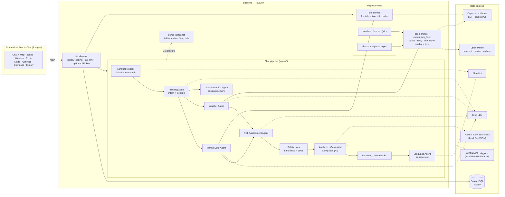

# ORCA

Marine EcoSystem Reasoning with Collaborative Agents. Our Smart India Hackathon 2026 project for problem statement SIH26176 (ISRO, Space Technology, Software).

Live demo: https://orca-frontend-oolk.onrender.com. It runs on Render's free tier, which puts the server to sleep when idle, so the first load can take about a minute.

[](https://github.com/Varunkumar-07/orca-sih2026/actions/workflows/ci.yml)

## Problem

Fishermen need to know whether a location is safe and worth going to today. That information exists, but it's spread across separate sources: PFZ advisories, weather and cyclone warnings, marine protected area boundaries, and satellite ocean data. SIH26176 asks for a multi-agent AI system that combines these into one answer.

## What ORCA does

You ask a question in plain language, in English or one of 10 Indian languages. A chain of agents works out the location and intent, pulls marine and weather data, assesses risk, and returns one answer with a verdict, a map, and a trace of what each agent did.

Features:

- Potential Fishing Zones detected from Copernicus SST and chlorophyll data around 11 coastal cities (up to 3 zones each). A zone is never placed inside a protected area; the next-best spot fills the slot. If the nearest city is more than 75 km from the asked location, the answer says so.
- Geofencing against WDPA marine protected area polygons. A location inside one is marked PROHIBITED; within 15 km of one gets a warning only.
- A* sea routing that avoids land and protected areas. Start or end points on land are moved to the nearest open water (up to 20 km), and the response says how far.
- Current weather from Open-Meteo, plus our own RandomForest models for a 7-day wave and wind forecast
- Cyclone and thunderstorm alerts for tracked fishing zones
- Analytics over 23 historical variables (waves, currents, wind, air, chlorophyll, salinity, dissolved oxygen, sunrise/sunset, moon phase), with CSV, JSON, PDF and DOCX export
- Query history stored in PostgreSQL
- Follow-up questions like "what about Friday?" reuse the last location for 30 minutes
- Translation through Bhashini (Hindi, Bengali, Punjabi, Gujarati, Odia, Tamil, Telugu, Kannada, Malayalam, Urdu)
- Chat and Route Planner use the browser's location when you allow it, so routes and geofence checks start from where you are

The Chat page has a Demo/Live toggle. Demo gives sample answers and works offline; Live uses real data and the LLM. It starts on Demo and remembers your last choice. A demo question that names another place moves the sample scenario there.

All API keys are optional. If one is missing or a feed fails, the answer says what's missing instead of crashing. `POST /query/demo` runs fully offline. If a live Groq call fails (rate limit, timeout, API error), `/query/full` serves the closest cached answer from `backend/schemas/demo_snapshot.py` and marks it in the trace.

The frontend has 9 pages: Home, Chat + Map, Zones Explorer, Weather, Route Planner, Alerts, Analytics, Download and History.

## Architecture



The Marine and Weather agents run at the same time; Risk waits for both.

The LLM (Groq, `openai/gpt-oss-20b`) handles only judgment calls: intent, location and the first risk verdict. Geofencing, PFZ scoring, A* routing and the forecast models are deterministic code.

Hard safety limits are also enforced in code, after the LLM gives its verdict (`backend/agents/deterministic/safety_limits.py`): wave height above 3 m, wind above 45 km/h, an active cyclone or lightning alert, or a location inside a protected area (PROHIBITED). If any of these is breached, the answer is "not safe" whatever the LLM said. The rules can only make a verdict stricter, never turn it into "safe". When the rules decide, the answer says "limit breached" instead of a confidence percentage, and a `safety_rules` step in the trace shows the LLM's original verdict and which limit was breached. The 3 m and 45 km/h values are the thresholds the LLM prompt used before they were moved into code.

## Tech stack

| Layer | Tools |
|---|---|
| Backend | Python 3.12, FastAPI, Uvicorn, Pydantic 2, python-dotenv |
| AI / LLM | Groq Python SDK (`openai/gpt-oss-20b`) |
| Data and geo | NumPy 2, pandas 3, xarray, Shapely 2, `copernicusmarine` 2, httpx; Natural Earth land data |
| ML | scikit-learn (RandomForestRegressor), joblib |
| Persistence | PostgreSQL, SQLAlchemy 2 (async) + asyncpg, Alembic |
| Reports | reportlab (PDF), python-docx (DOCX) |
| Frontend | React 19, TypeScript 6, Vite 8, Tailwind CSS 4, React Router 7, Leaflet / react-leaflet 5, Recharts 3 |
| Testing | pytest, Vitest 5 + React Testing Library, oxlint |
| CI / deploy | GitHub Actions, Render (`render.yaml`) |

## Local setup

**Prerequisites:** Python 3.12, Node.js 22, PostgreSQL. PostgreSQL is only needed for the History page and the backend tests.

### Backend

The backend imports itself as the `backend` package, so **run the server from the repo root**, not from inside `backend/`.

```bash
cd backend
python3.12 -m venv .venv
source .venv/bin/activate
pip install -r requirements.txt
cp .env.example .env
```

Edit `backend/.env`:
- Set `DATABASE_URL` to your local Postgres user and database.
- Fill in any keys you have. All keys are optional, and any left as the `your-...-here` placeholder are treated as unset.

Then create the database, apply migrations and start the server:

```bash
createdb orca_dev
alembic upgrade head
cd ..
uvicorn backend.main:app --reload --port 8000
```

Check it's running:

```bash
curl http://127.0.0.1:8000/health
```

To try the pipeline with no API keys:

```bash
curl -X POST http://127.0.0.1:8000/query/demo -H "Content-Type: application/json" -d '{"query": "can I fish near Gulf of Mannar"}'
```

### Frontend

Run this in a second terminal:

```bash
cd frontend
npm ci
npm run dev
```

The app runs at http://localhost:5173. The Vite dev server proxies `/api/*` to the backend on port 8000.

### Pre-commit secret scanner (recommended)

Run this once per clone to enable the hook in `.githooks/`, which blocks commits containing credential-like files or content:

```bash
git config core.hooksPath .githooks
```

## Environment variables

Full descriptions are in [`backend/.env.example`](backend/.env.example) and [`frontend/.env.example`](frontend/.env.example). Every variable is optional.

**Backend** (`backend/.env`)

| Variable | Purpose |
|---|---|
| `GROQ_API_KEY` | LLM for the Planning, Marine, Weather and Risk agents. Without it, `/query/full` falls back to the offline demo fixtures. |
| `COPERNICUSMARINE_USERNAME`, `COPERNICUSMARINE_PASSWORD` | Live SST and chlorophyll grids for PFZ detection and chlorophyll readings. Without them, no PFZ zones are returned. |
| `BHASHINI_USER_ID`, `BHASHINI_ULCA_API_KEY` | Translation to and from Indian languages. Without them, language is still detected but the pipeline runs in English. |
| `PROTECTED_PLANET_API_KEY` | Only for `python -m backend.scripts.fetch_mpa_boundaries`, which refreshes the cached MPA polygons. |
| `DATABASE_URL` | PostgreSQL connection string (`postgresql+asyncpg://…`) for History. Without it, history logging is a no-op. |
| `ORCA_API_KEY` | When set, every request except `/health` needs a matching `X-API-Key` header. |
| `RATE_LIMIT_ENABLED`, `RATE_LIMIT_PER_MINUTE` | Per-IP rate limiting, which is on by default. |
| `MAX_REQUEST_BODY_BYTES` | Maximum request body size (default 2 MiB). |
| `OPEN_METEO_API_KEY` | Paid Open-Meteo key. Without it, the free keyless tier is used, whose daily quota is per IP and can run out on shared hosts like Render. |

**Frontend** (`frontend/.env`)

| Variable | Purpose |
|---|---|
| `VITE_ORCA_API_KEY` | Sent as `X-API-Key`. Must match the backend's `ORCA_API_KEY`, and is only needed when that is set. |

## Running tests

**Backend.** The tests use a separate `orca_test` database (see `backend/tests/conftest.py`). Create and migrate it once:

```bash
createdb orca_test
cd backend
DATABASE_URL=postgresql+asyncpg://$USER@localhost:5432/orca_test alembic upgrade head
cd ..
```

Then run the suite from the repo root, with the venv active:

```bash
PYTHONPATH=. python -m pytest backend/tests -q
```

With no API keys set, the suite runs offline and external APIs are mocked; this is how CI runs it. The app loads `backend/.env`, so if it holds real keys, a few tests make real calls: `test_live_smoke.py` calls Groq and Copernicus (it skips itself unless a real `GROQ_API_KEY` is set), and the `/export` history test fetches from Open-Meteo and Copernicus. Those depend on the network and can be slow. To run the suite the way CI does, blank the keys for that run:

```bash
GROQ_API_KEY= COPERNICUSMARINE_USERNAME= COPERNICUSMARINE_PASSWORD= PYTHONPATH=. python -m pytest backend/tests -q
```

**Frontend**

```bash
cd frontend
npm run lint
npm test
npm run build
```

**CI.** [`ci.yml`](.github/workflows/ci.yml) runs both suites on every push and pull request. [`live-smoke.yml`](.github/workflows/live-smoke.yml) runs the live smoke test daily, and [`models.yml`](.github/workflows/models.yml) retrains and validates the forecast models weekly.

## Forecast models

`GET /weather/forecast` uses 7 RandomForest models in `backend/models/`, one per day ahead (`forecast_day1.pkl` to `forecast_day7.pkl`). Each one predicts both wave height (m) and max wind speed (km/h).

- Data: daily Open-Meteo marine and weather archives, requested from 2021-11-01 to two days before the training run. The training script asks for the same 11 cities used for PFZ detection, but only 9 have data: the Goa and Kolkata city points are inland and the marine archive returns nothing there. PFZ detection is not affected, since it scans a grid box around each city rather than the city point itself.
- Daily SST is missing for about 400 days before early 2025, and rows with a missing feature are dropped, so the usable training data starts on 2022-11-23.
- Features: lat, lon, month (sin/cos), wave height and its previous-day value, wind speed and its previous-day value, SST, air temperature.
- Each horizon is predicted directly from real day-0 values. Predictions are never fed back in as inputs. The target and the previous-day values are joined by calendar date, so a missing day is dropped rather than filled from a neighbouring row.
- Split: one cutoff date for all cities. Dates before it (about 80% of them) are for training, the rest for testing. A training row is only kept if the day it predicts is also before the cutoff, so no date's data is on both sides.
- Targets: wave (metres) and wind (km/h) are standardized (z-scored with training-set stats) before fitting, and converted back when predicting. Without this, wind's larger numbers dominated the tree splits and wave height was barely learned. We compared this with predicting the change from day 0, choosing on the last 15% of the training period only, never on the test set.
- Settings: 100 trees, `max_depth=12`, `min_samples_leaf=5`. The depth cap keeps each file small enough to commit (about 9 to 11 MB each).

To tell whether the models are any good, each one is scored against two simple baselines on the same test rows: persistence (day+N is the same as today) and climatology (the average for that city and calendar month, from training data only). Test-set MAE from [`forecast_metrics.json`](backend/models/forecast_metrics.json), which also records RMSE, skill scores, the split dates and when the models were trained:

| Day | Wave model (m) | Wave persistence | Wave climatology | Wind model (km/h) | Wind persistence | Wind climatology |
|---|---|---|---|---|---|---|
| 1 | 0.120 | 0.120 | 0.202 | 2.47 | 2.61 | 3.49 |
| 2 | 0.167 | 0.177 | 0.202 | 2.98 | 3.32 | 3.49 |
| 3 | 0.187 | 0.213 | 0.202 | 3.19 | 3.74 | 3.49 |
| 4 | 0.196 | 0.230 | 0.202 | 3.23 | 3.93 | 3.49 |
| 5 | 0.203 | 0.243 | 0.202 | 3.29 | 4.02 | 3.49 |
| 6 | 0.209 | 0.254 | 0.202 | 3.36 | 4.17 | 3.49 |
| 7 | 0.214 | 0.260 | 0.202 | 3.39 | 4.24 | 3.49 |

Wind beats both baselines at every horizon, though only narrowly against climatology by days 6 and 7. Wave height beats persistence on days 2 to 7 and ties it on day 1, and beats climatology up to day 4; from day 5 on, the city's monthly average is slightly more accurate than the model.

Retrain and check them from the repo root:

```bash
python -m backend.scripts.train_forecast_models
```

```bash
python -m backend.scripts.validate_forecast_models
```

The validate script prints the model-vs-baseline table and warns, without failing, wherever the model loses to a baseline.

## Deployment (Render)

[`render.yaml`](render.yaml) is a Render Blueprint. It creates three things on the free plan: the `orca-db` Postgres database, the `orca-backend` web service and the `orca-frontend` static site.

- The backend builds with `pip install -r backend/requirements.txt` and starts with `uvicorn backend.main:app` from the repo root. Its health check is `/health`.
- `DATABASE_URL` is wired from `orca-db` automatically. The backend rewrites Render's `postgres://` URL to `postgresql+asyncpg://` itself.
- Migrations don't run on deploy. After the first deploy, run `alembic upgrade head` once against `orca-db`, either from the backend's Render shell or locally with `DATABASE_URL` set to the database's external URL.
- The other backend variables (`GROQ_API_KEY`, `COPERNICUSMARINE_*`, `BHASHINI_*`, `PROTECTED_PLANET_API_KEY`, `ORCA_API_KEY`, `OPEN_METEO_API_KEY`) are set in the Render dashboard, not in `render.yaml`.
- The frontend is served as static files. Render rewrites `/api/*` to the backend's URL, so the browser only talks to the frontend's origin and no CORS changes are needed. If the backend URL changes, update the rewrite in `render.yaml`.
- `VITE_ORCA_API_KEY` is read at build time and ends up in the JS bundle, where anyone can see it. It only needs to match `ORCA_API_KEY` if that's set, and changing it needs a frontend redeploy.
- Render's free database expires 30 days after creation, then gets deleted after a further 14-day grace period. Upgrade the plan or re-create it if the project needs to run longer.

The free web service has 0.1 CPU and 512 MB of RAM, and its outbound IPs are shared with other tenants. A few things in the backend exist because of that:

- `services/open_meteo.py` caches responses, allows at most 4 requests at once, retries temporary errors, and stops calling a host for a while after a quota error.
- `services/copernicus_fetch.py` runs each Copernicus read as a shared background job and caches the result, since one read takes about 30 s on 0.1 CPU.
- `services/heavy_work.py` lets only one memory-heavy Copernicus job run at a time.

## Project structure

```
.
├── backend/            FastAPI app
│   ├── agents/         reasoning agents + deterministic modules
│   │   └── deterministic/data/   cached MPA polygons + land mask (GeoJSON)
│   ├── services/       PFZ detection, weather, forecast, alerts, analytics, export,
│   │                   Open-Meteo/Copernicus access
│   ├── routers/        HTTP endpoints (chat, pages, history)
│   ├── schemas/        API contracts, test fixtures, demo data and fallback snapshots
│   ├── history/        PostgreSQL history logging
│   ├── alembic/        database migrations
│   ├── models/         trained forecast models (.pkl) + metrics
│   ├── scripts/        MPA boundary fetch, land mask build, model training/validation
│   ├── tests/          pytest suite
│   ├── auth.py         optional X-API-Key check
│   └── rate_limit.py   per-IP rate limiting
├── frontend/           React + Vite app (9 pages)
├── .github/workflows/  CI, live smoke test, model retraining
├── .githooks/          pre-commit secret scanner
└── render.yaml         Render deployment blueprint
```

Endpoint reference and implementation details: [`backend/README.md`](backend/README.md).

## Team

**Team NEXORA** · Team ID: 159223

| Name | Role | GitHub |
|---|---|---|
| Kinshue Priya M | Frontend | [@Kinshuepriya](https://github.com/Kinshuepriya) |
| Varun Kumar U | Backend & ML | [@Varunkumar-07](https://github.com/Varunkumar-07) |
| Mohammed Bilal Sharief | Backend & ML | [@MOHAMMEDBILAL-007](https://github.com/MOHAMMEDBILAL-007) |
| Vedha V | Frontend | [@ved-24-2006](https://github.com/ved-24-2006) |
| M.K. Reddy Venkata Santhosh | Research | [@SANTHOSHMK07](https://github.com/SANTHOSHMK07) |
| Rakesh Patil | Design | [@Raku770](https://github.com/Raku770) |
