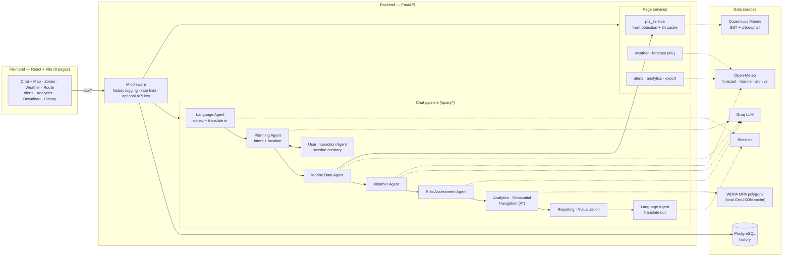

# ORCA

Marine EcoSystem Reasoning with Collaborative Agents. Our Smart India Hackathon 2026 project for problem statement SIH26176 (ISRO, Space Technology, Software).

[](https://github.com/Varunkumar-07/orca-sih2026/actions/workflows/ci.yml)

## Problem

Fishermen need to know whether a location is safe and worth going to today. That information exists, but it's spread across separate sources: PFZ advisories, weather and cyclone warnings, marine protected area boundaries, and satellite ocean data. SIH26176 asks for a multi-agent AI system that combines these into one answer.

## What ORCA does

You ask a question in plain language, in English or one of 10 Indian languages. A chain of agents works out the location and intent, pulls marine and weather data, assesses risk, and returns one answer with a verdict, a map, and a trace of what each agent did.

Features:

- Potential Fishing Zones detected from Copernicus SST and chlorophyll data around 11 coastal cities (up to 3 zones each)
- Geofencing against WDPA marine protected area polygons; any location inside one is marked PROHIBITED
- A* route planning that avoids restricted zones
- Current weather from Open-Meteo, plus our own RandomForest models for a 7-day wave and wind forecast
- Cyclone and thunderstorm alerts for tracked fishing zones
- Historical data with CSV, JSON, PDF and DOCX export
- Query history stored in PostgreSQL
- Follow-up questions like "what about Friday?" reuse the last location for 30 minutes
- Translation through Bhashini (Hindi, Bengali, Punjabi, Gujarati, Odia, Tamil, Telugu, Kannada, Malayalam, Urdu)

All API keys are optional. If one is missing or a feed fails, the answer says what's missing instead of crashing. `POST /query/demo` runs fully offline.

The frontend has 9 pages: Home, Chat + Map, Zones Explorer, Weather, Route Planner, Alerts, Analytics, Download and History.

## Architecture



The LLM (Groq, `openai/gpt-oss-20b`) handles only judgment calls: intent, location and risk reasoning. Geofencing, thresholds, PFZ scoring, A* routing and the forecast models are deterministic code.

## Tech stack

| Layer | Tools |
|---|---|
| Backend | Python 3.12, FastAPI, Uvicorn, Pydantic |
| AI / LLM | Groq (`openai/gpt-oss-20b`) |
| Data and geo | NumPy, pandas, xarray, Shapely, `copernicusmarine`, httpx |
| ML | scikit-learn (RandomForestRegressor), joblib |
| Persistence | PostgreSQL, SQLAlchemy (async) + asyncpg, Alembic |
| Reports | reportlab (PDF), python-docx (DOCX) |
| Frontend | React 19, TypeScript, Vite, Tailwind CSS, React Router, Leaflet / react-leaflet, Recharts |
| Testing | pytest, Vitest + React Testing Library, oxlint |
| CI / deploy | GitHub Actions, Render (`render.yaml`) |

## Local setup

**Prerequisites:** Python 3.12, Node.js 22, PostgreSQL. PostgreSQL is only needed for the History page and the backend tests.

### Backend

The backend imports itself as the `backend` package, so **run the server from the repo root**, not from inside `backend/`.

```bash
cd backend
python3.12 -m venv .venv
source .venv/bin/activate
pip install -r requirements.txt
cp .env.example .env
```

Edit `backend/.env`:
- Set `DATABASE_URL` to your local Postgres user and database.
- Delete every line you don't have a real value for. All keys are optional, and a leftover placeholder for the Copernicus credentials will be sent as a real login attempt.

Then create the database, apply migrations and start the server:

```bash
createdb orca_dev
alembic upgrade head
cd ..
uvicorn backend.main:app --reload --port 8000
```

Check it's running:

```bash
curl http://127.0.0.1:8000/health
```

To try the pipeline with no API keys:

```bash
curl -X POST http://127.0.0.1:8000/query/demo -H "Content-Type: application/json" -d '{"query": "can I fish near Gulf of Mannar"}'
```

### Frontend

Run this in a second terminal:

```bash
cd frontend
npm ci
npm run dev
```

The app runs at http://localhost:5173. The Vite dev server proxies `/api/*` to the backend on port 8000.

### Pre-commit secret scanner (recommended)

Run this once per clone to enable the hook in `.githooks/`, which blocks commits containing credential-like files or content:

```bash
git config core.hooksPath .githooks
```

## Environment variables

Full descriptions are in [`backend/.env.example`](backend/.env.example) and [`frontend/.env.example`](frontend/.env.example). Every variable is optional.

**Backend** (`backend/.env`)

| Variable | Purpose |
|---|---|
| `GROQ_API_KEY` | LLM for the Planning, Marine, Weather and Risk agents. Without it, `/query/full` falls back to the offline demo fixtures. |
| `COPERNICUSMARINE_USERNAME`, `COPERNICUSMARINE_PASSWORD` | Live SST and chlorophyll grids for PFZ detection and chlorophyll readings. Without them, no PFZ zones are returned. |
| `BHASHINI_USER_ID`, `BHASHINI_ULCA_API_KEY` | Translation to and from Indian languages. Without them, language is still detected but the pipeline runs in English. |
| `PROTECTED_PLANET_API_KEY` | Only for `python -m backend.scripts.fetch_mpa_boundaries`, which refreshes the cached MPA polygons. |
| `DATABASE_URL` | PostgreSQL connection string (`postgresql+asyncpg://…`) for History. Without it, history logging is a no-op. |
| `ORCA_API_KEY` | When set, every request except `/health` needs a matching `X-API-Key` header. |
| `RATE_LIMIT_ENABLED`, `RATE_LIMIT_PER_MINUTE` | Per-IP rate limiting, which is on by default. |
| `MAX_REQUEST_BODY_BYTES` | Maximum request body size (default 2 MiB). |

**Frontend** (`frontend/.env`)

| Variable | Purpose |
|---|---|
| `VITE_ORCA_API_KEY` | Sent as `X-API-Key`. Must match the backend's `ORCA_API_KEY`, and is only needed when that is set. |

## Running tests

**Backend.** The tests use a separate `orca_test` database (see `backend/tests/conftest.py`). Create and migrate it once:

```bash
createdb orca_test
cd backend
DATABASE_URL=postgresql+asyncpg://$USER@localhost:5432/orca_test alembic upgrade head
cd ..
```

Then run the suite from the repo root, with the venv active:

```bash
PYTHONPATH=. python -m pytest backend/tests -q
```

The suite runs offline, and external APIs are mocked. `test_live_smoke.py` makes real Groq and Copernicus calls and skips itself unless a real `GROQ_API_KEY` is set.

**Frontend**

```bash
cd frontend
npm run lint
npm test
npm run build
```

**CI.** [`ci.yml`](.github/workflows/ci.yml) runs both suites on every push and pull request. [`live-smoke.yml`](.github/workflows/live-smoke.yml) runs the live smoke test daily, and [`models.yml`](.github/workflows/models.yml) retrains and validates the forecast models weekly.

## Project structure

```
.
├── backend/            FastAPI app
│   ├── agents/         reasoning agents (LLM) + deterministic modules
│   ├── services/       PFZ detection, weather, forecast, alerts, analytics, export
│   ├── routers/        HTTP endpoints (chat, pages, history)
│   ├── history/        PostgreSQL history logging
│   ├── alembic/        database migrations
│   ├── models/         trained forecast models (.pkl)
│   ├── scripts/        MPA boundary fetch, model training/validation
│   └── tests/          pytest suite
├── frontend/           React + Vite app (9 pages)
├── .github/workflows/  CI, live smoke test, model retraining
├── .githooks/          pre-commit secret scanner
└── render.yaml         Render deployment blueprint
```

Endpoint reference and implementation details: [`backend/README.md`](backend/README.md).

## Team

**Team NEXORA** · Team ID: 159223

| Name | Role | GitHub |
|---|---|---|
| Kinshue Priya M | Frontend | [@Kinshuepriya](https://github.com/Kinshuepriya) |
| Varun Kumar U | Backend & ML | [@Varunkumar-07](https://github.com/Varunkumar-07) |
| Mohammed Bilal Sharief | Backend & ML | [@MOHAMMEDBILAL-007](https://github.com/MOHAMMEDBILAL-007) |
| Vedha V | Frontend | [@ved-24-2006](https://github.com/ved-24-2006) |
| M.K. Reddy Venkata Santhosh | Research | [@SANTHOSHMK07](https://github.com/SANTHOSHMK07) |
| Rakesh Patil | Design | [@Raku770](https://github.com/Raku770) |
